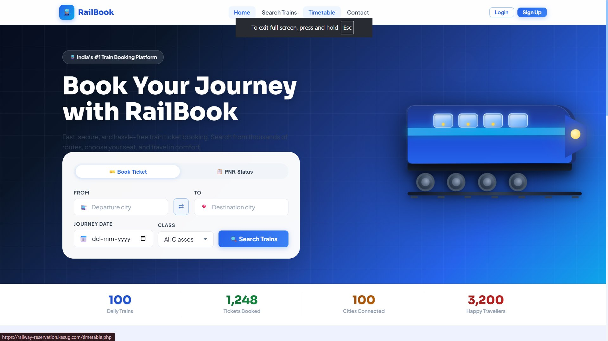
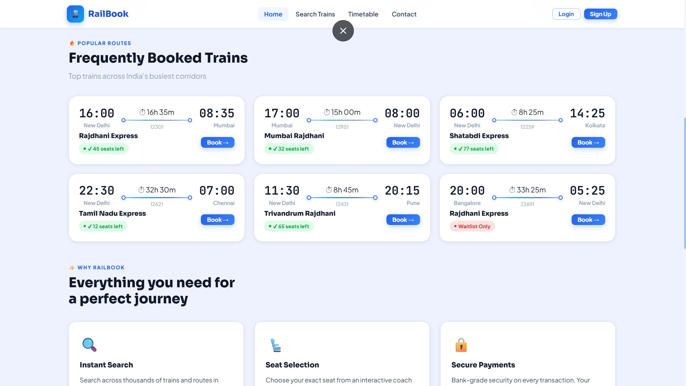
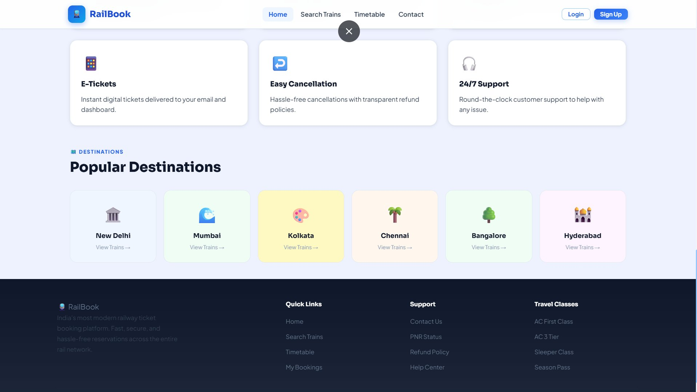
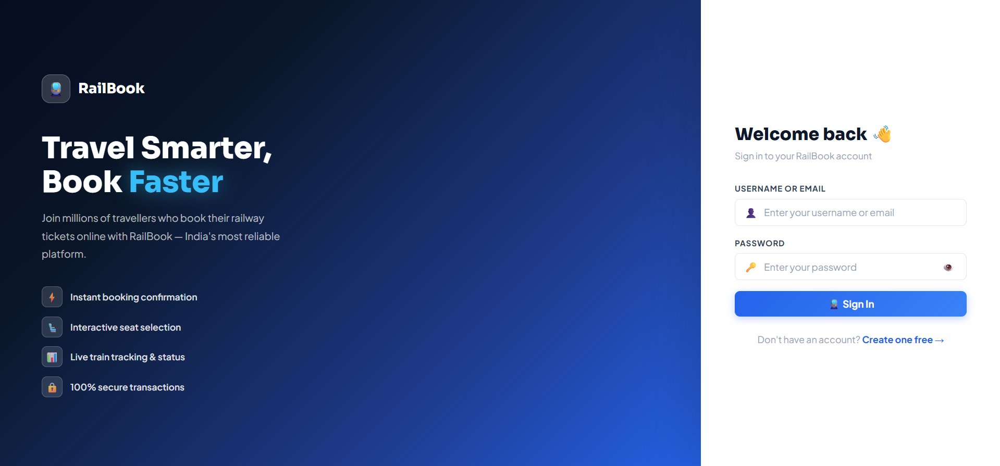
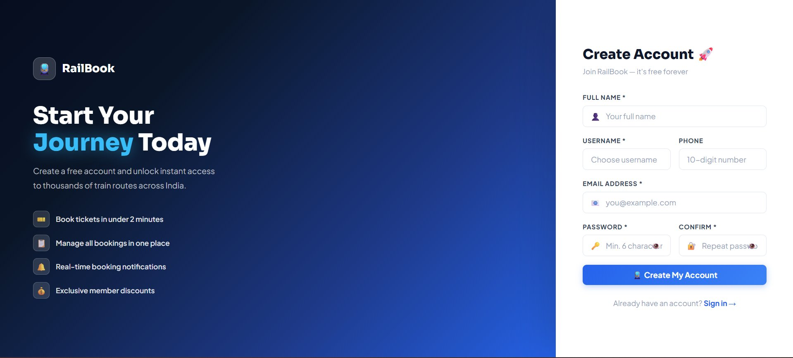
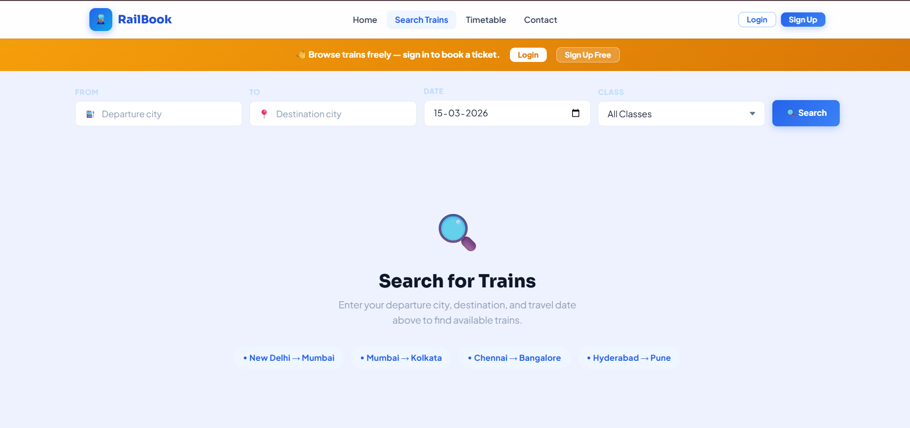
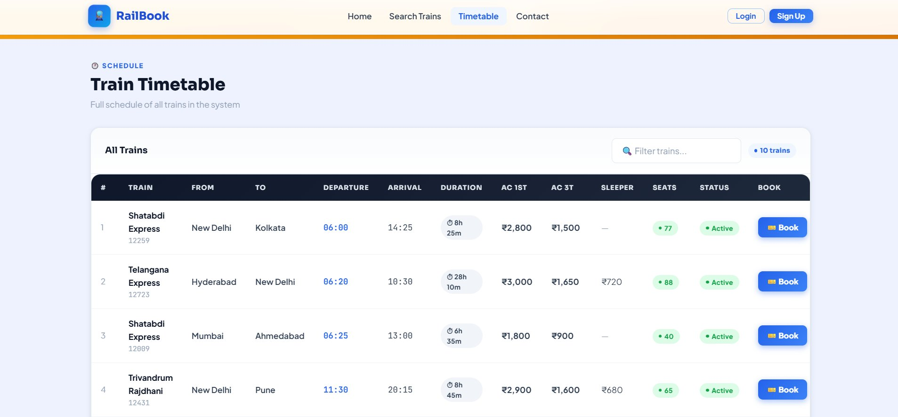
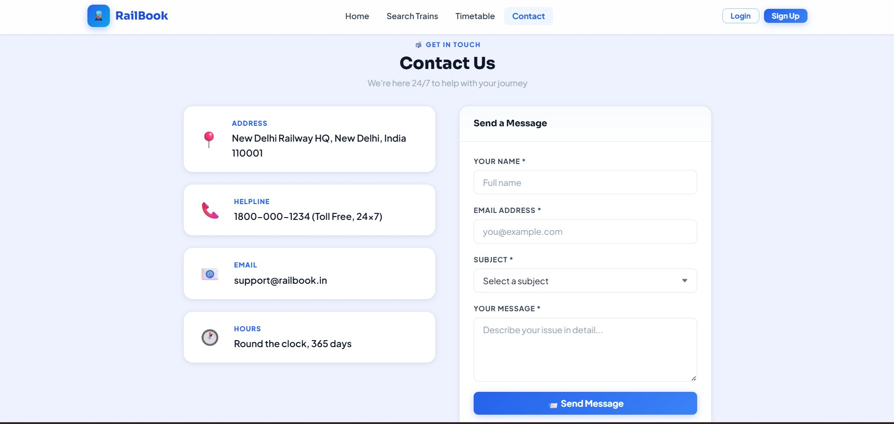

# 🚆 RailBook — Railway Reservation System

<div align="center">



<br/><br/>

**A modern, full-featured Railway Reservation System built with PHP, MySQL, HTML, CSS & JavaScript**

<br/>

[](https://php.net)
[](https://mysql.com)
[](https://developer.mozilla.org/en-US/docs/Web/JavaScript)
[](https://www.w3.org/Style/CSS/)
[](https://www.apachefriends.org)

<br/>

🌐 **Live Demo:** [railway-reservation.kesug.com](https://railway-reservation.kesug.com)

</div>

---

## 📋 Table of Contents

- [Overview](#-overview)
- [Screenshots](#-screenshots)
- [Features](#-features)
- [Tech Stack](#-tech-stack)
- [Project Structure](#-project-structure)
- [Installation](#-installation)
- [Database Setup](#-database-setup)
- [Default Credentials](#-default-credentials)
- [Pages & Routes](#-pages--routes)

---

## 🌟 Overview

**RailBook** is a modern PHP-based Railway Reservation System with guest browsing, multi-passenger booking, interactive seat selection, e-ticket download, and PNR tracking. Features a 4-step booking wizard, user profile dashboard, and a full Admin Panel with live analytics — all wrapped in a sleek, responsive UI with 3D animated elements.

---

## 📸 Screenshots

### 🏠 Home — Hero & Search
> 3D animated train, glassmorphism search box with Book Ticket & PNR Status tabs, live stat counters


<br/>

### 🚆 Home — Popular Routes
> Frequently booked trains with live seat counts, Why RailBook feature cards



<br/>

### 🗺️ Home — Destinations & Footer
> Popular destination cards, feature highlights, full footer with links



<br/>

### 🔐 Login
> Split-screen layout — feature highlights on left, clean login form on right



<br/>

### 📝 Sign Up
> Registration with full name, username, phone, email and password fields



<br/>

### 🔍 Search Trains
> Guest-accessible with login prompt, city autocomplete, popular route quick links



<br/>

### 🕐 Train Timetable
> Full schedule with live filter, fares per class, seat count, status and Book button



<br/>

### 📬 Contact Us
> Address, helpline, email and hours panel alongside a contact form



<br/>

> 🔒 **More features inside:** Book Ticket 4-step wizard, Interactive Seat Map, Booking Confirmation with PNR, My Bookings dashboard, User Profile with achievements, E-Ticket download, and full Admin Panel with charts. **Explore by creating a free account on the [live demo](https://railway-reservation.kesug.com)!**

---

## ✨ Features

### 👤 User Features
| Feature | Description |
|---|---|
| 🔓 Guest Browsing | Browse trains & timetable without an account |
| 🔐 Auth System | Register, login, logout with session management |
| 🔍 Train Search | Search by city, date and class with live filters |
| 🎫 4-Step Booking | Train → Passengers → Seat Map → Payment wizard |
| 👥 Multi-Passenger | Book for up to 6 passengers with individual details |
| 🗺️ Seat Map | Interactive coach seat map — click to select seats |
| 🔖 PNR Status | Check booking status from the home page |
| 📋 My Bookings | View, cancel and download all your trips |
| ⬇️ E-Ticket | Printable ticket with barcode and passenger list |
| 👤 User Profile | Edit details, change password, view travel stats |
| 🏆 Achievements | Unlockable badges based on travel history |

### ⚙️ Admin Features
| Feature | Description |
|---|---|
| 📊 Dashboard | Live stats, 7-day booking chart, class distribution |
| 🎫 Bookings | View all bookings, update status, search and filter |
| 🚆 Trains | Add, edit and delete trains with fares and schedule |
| 👥 Users | Manage accounts and change user roles |
| 📬 Messages | View contact submissions and mark as read |

### 🎨 UI Highlights
- 3D animated train — spinning wheels, headlight pulse, smoke puffs
- Glassmorphism search box with backdrop blur
- Floating particle animations in the hero background
- Animated number counters on all statistics
- Smooth 4-step stepper with done/active visual states
- Toast notifications for every user action
- Fully responsive — desktop, tablet and mobile

---

## 🛠️ Tech Stack

| Layer | Technology |
|---|---|
| **Backend** | PHP 8.0+ (MySQLi, Sessions) |
| **Database** | MySQL 8.0+ |
| **Frontend** | HTML5, CSS3, Vanilla JavaScript ES6+ |
| **Charts** | Chart.js 4.4 |
| **Fonts** | Plus Jakarta Sans, Sora, JetBrains Mono |
| **Server** | Apache via XAMPP / WAMP / LAMP |
| **Hosting** | [railway-reservation.kesug.com](https://railway-reservation.kesug.com) |

---

## 📁 Project Structure

```
railway/
│
├── 📄 index.php               # Home — hero, search, popular trains
├── 📄 login.php               # User login
├── 📄 signup.php              # User registration
├── 📄 logout.php              # Session destroy
├── 📄 search.php              # Search trains (guest accessible)
├── 📄 book-ticket.php         # 4-step booking wizard (multi-passenger)
├── 📄 booking-confirm.php     # Booking confirmation + PNR
├── 📄 download-ticket.php     # E-ticket printable view
├── 📄 my-bookings.php         # User booking history + cancel
├── 📄 profile.php             # Profile, stats and achievements
├── 📄 timetable.php           # Train schedule (guest accessible)
├── 📄 contact.php             # Contact form
├── 📄 config.php              # DB connection + helpers
├── 📄 database.sql            # Schema + seed data
│
├── 📁 admin/
│   ├── 📄 index.php           # Dashboard with Chart.js
│   ├── 📄 bookings.php        # Manage bookings
│   ├── 📄 trains.php          # Add / edit / delete trains
│   ├── 📄 users.php           # Manage users and roles
│   └── 📄 messages.php        # Contact submissions
│
├── 📁 includes/
│   ├── 📄 navbar.php          # Shared navigation bar
│   └── 📄 footer.php          # Shared footer
│
├── 📁 assets/
│   ├── 📁 css/style.css       # Design system (750+ lines)
│   └── 📁 js/app.js           # Seat map, stepper, toasts, autocomplete
│
└── 📁 screenshots/            # README images
```

---

## ⚙️ Installation

### Prerequisites
- [XAMPP](https://www.apachefriends.org/) (or WAMP / LAMP)
- PHP 8.0+
- MySQL 8.0+

### Steps

**1. Clone the repository**
```bash
git clone https://github.com/arcrtic/railway_reservation.git
```

**2. Move to XAMPP web root**
```bash
# Windows
cp -r railway_reservation C:\xampp\htdocs\railway

# macOS / Linux
cp -r railway_reservation /Applications/XAMPP/htdocs/railway
```

**3. Start XAMPP**

Open XAMPP Control Panel → Start **Apache** and **MySQL**

**4. Import the database**

Open [http://localhost/phpmyadmin](http://localhost/phpmyadmin)
- Click **New** → Name: `railway_reservation_db` → **Create**
- Go to **SQL** tab → paste `database.sql` contents → **Go**

**5. Check config.php**
```php
define('DB_HOST', 'localhost');
define('DB_USER', 'root');
define('DB_PASS', '');               // Default XAMPP password
define('DB_NAME', 'railway_reservation_db');
```

**6. Open in browser**
```
http://localhost/railway/
```

---

## 🗄️ Database Setup

`database.sql` includes:

- ✅ Complete schema for all 5 tables
- ✅ 10 pre-seeded trains across major Indian routes
- ✅ Default admin account
- ✅ Multi-passenger `booking_passengers` table

| Table | Description |
|---|---|
| `users` | Registered users and admins |
| `trains` | Schedules, fares, availability |
| `bookings` | All bookings with PNR |
| `booking_passengers` | Per-passenger details |
| `contacts` | Contact form messages |

---

## 🔑 Default Credentials

| Role | Username | Password |
|---|---|---|
| **Admin** | `admin` | `admin123` |
| **User** | Sign up at `/signup.php` | Your choice |

> ⚠️ Change the admin password before deploying to production.

---

## 🗺️ Pages & Routes

| URL | Page | Access |
|---|---|---|
| `/` | Home | 🌐 Public |
| `/login.php` | Login | 🌐 Public |
| `/signup.php` | Register | 🌐 Public |
| `/search.php` | Search Trains | 🌐 Public |
| `/timetable.php` | Timetable | 🌐 Public |
| `/contact.php` | Contact | 🌐 Public |
| `/book-ticket.php` | Book Ticket | 🔒 Login to submit |
| `/booking-confirm.php` | Confirmation | 🔒 User |
| `/download-ticket.php` | E-Ticket | 🔒 User |
| `/my-bookings.php` | My Bookings | 🔒 User |
| `/profile.php` | Profile | 🔒 User |
| `/admin/` | Admin Panel | 🔑 Admin only |

---

## 🤝 Contributing

1. Fork the repository
2. Create a branch: `git checkout -b feature/your-feature`
3. Commit: `git commit -m 'Add your feature'`
4. Push: `git push origin feature/your-feature`
5. Open a Pull Request

---

## 📄 License

This project is open source under the [MIT License](LICENSE).

---

<div align="center">

**Built with ❤️ for Indian Railways**

🌐 [Live Demo](https://railway-reservation.kesug.com) &nbsp;•&nbsp; 👤 [GitHub @arcrtic](https://github.com/arcrtic)

⭐ Star this repo if you found it helpful!

</div>
